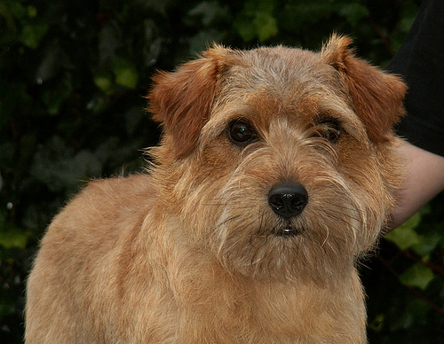

# Machine Learning Engineer Nanodegree

## Capstone Proposal

#### Name: Ahmed Monjurul Hasan
#### Date: Jan 16, 2020

## Proposal

### Domain Background
 | 

 There are thousands of different dog breeds in the world. Some of these dog breeds are too close to differentiate from their images. For example, the above two dogs seem to belong to the same breed. But, the left one is Norfolk Terrier, and the right one Norwich Terrier.  With the advancement of technology, computers are getting enough intelligent to distigush different classes of objects from their images. Since 2010, the ImageNet project runs an annual software contest, the ImageNet Large Scale Visual Recognition Challenge (ILSVRC), where software programs compete to correctly classify and detect objects and scenes useing one thousand non-overlapping classes [1]. In this capstone project, I want to leverage the state of art of image classification model on Imagenet to teach computer to predict 133 dog's breed from an image using deep learning algorithms.

### Problem Statement

 I want to go above and beyond the dog's breed classification problem by tackling two minor but interesting problems as well such as human face detection and dog detection using computer vision and machine learning techniques. Using these three solutions, I would like to build an application that could be used as part of a mobile or web app. This application  will accept any user-supplied image as input. If a dog is detected in the image, it will provide an estimate of the dog's breed. If a human is detected, it will provide an estimate of the dog breed that is most resembling. If it detects neither a dog nor a human, it will give an appropriate error message.

### Datasets and Inputs

 The dog dataset has 6680 images for training, 835 images for validation and 836 images for testing of 133 breeds. The human dataset has 13233 human images. All these images have RGB channels and different sizes. So, they need to normalized and resiaed before using in the deep learning model.

### Solution Statement

 The solution of the project is divided into following steps:
In the first step, I'll use OpenCV's implementation of Haar feature-based cascade classifiers to detect human faces in images. In the seond step, I'll use a pre-trained VGG16 model to detect dogs in images. In the third step, I'll create a CNN that classifies dog breeds. I'll create my CNN from scratch to attain a test accuracy of at least 1%. In the fourth step, I'll use the pre-trained VGG-16 model as a fixed feature extractor, where the last convolutional output of VGG-16 is fed as input to my model. In Step 5, I'll use transfer learning to create a CNN using VGG-19 bottleneck features. In the last step, I'll write an algorithm that accepts a file path to an image and first determines whether the image contains a human, dog, or neither. Then, if a dog is detected in the image, return the predicted breed. If a human is detected in the image, return the resembling dog breed. Otherwise, it provides output that indicates an error.

### Benchmark Model

 Our model will be compared with different benchmark models in a 
kaggle competition(https://www.kaggle.com/c/dog-breed-identification/discussion)

### Evaluation Metrics

 Since we are dealing with a multi-classification problem here and the data is slightly imbalanced, I used accuracy evaluation metric and negative log-likelihood loss function. The main objective in a learning model is to reduce (minimize) the loss function's value with respect to the model's parameters by changing the weight vector values through different optimization methods, such as backpropagation in neural networks.

### Project Design
- [Implementation](#implement)
  - [Step 1](#step1): Detect Humans
  - [Step 2](#step2): Detect Dogs
  - [Step 3](#step3): Create a CNN to Classify Dog Breeds (from Scratch)
  - [Step 4](#step4): Use a CNN to Classify Dog Breeds (using Transfer Learning)
  - [Step 5](#step5): Create a CNN to Classify Dog Breeds (using Transfer Learning)
  - [Step 6](#step6): Write Algorithm

[1] Olga Russakovsky*, Jia Deng*, Hao Su, Jonathan Krause, Sanjeev Satheesh, Sean Ma, Zhiheng Huang, Andrej Karpathy, Aditya Khosla, Michael Bernstein, Alexander C. Berg and Li Fei-Fei. (* = equal contribution) ImageNet Large Scale Visual Recognition Challenge. IJCV, 2015.
