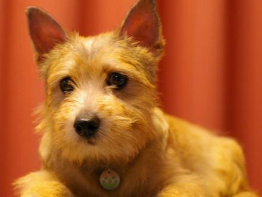

# Machine Learning Engineer Nanodegree

## Capstone Proposal

#### Name: Ahmed Monjurul Hasan
#### Date: Jan 16, 2020

## Proposal

### Domain Background
 | 

 If you look at the two dog pictures above, you might thought they are the same breed. But, you would be surprised to know that they are quite different. The left one is Norfolk Terrier, and the right one Norwich Terrier. There are thousands of different dog breeds in the world. Some of them are so visually distinct  that it is easily possible to tell their breeds from their images. But, for some breeds like the above image pair, it is quite difficult to distinguish them. In order to solve this problem, I want to leverage the state of art of image classification model on Imagenet to teach computer to predict dog's breed from an image using deep learning algorithms.

